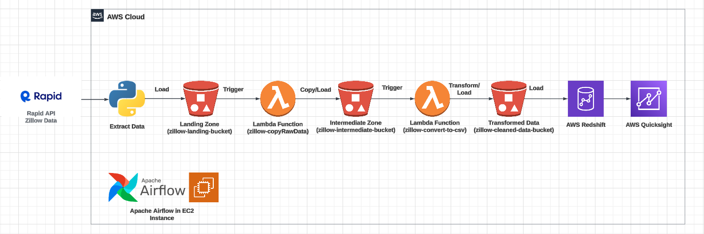
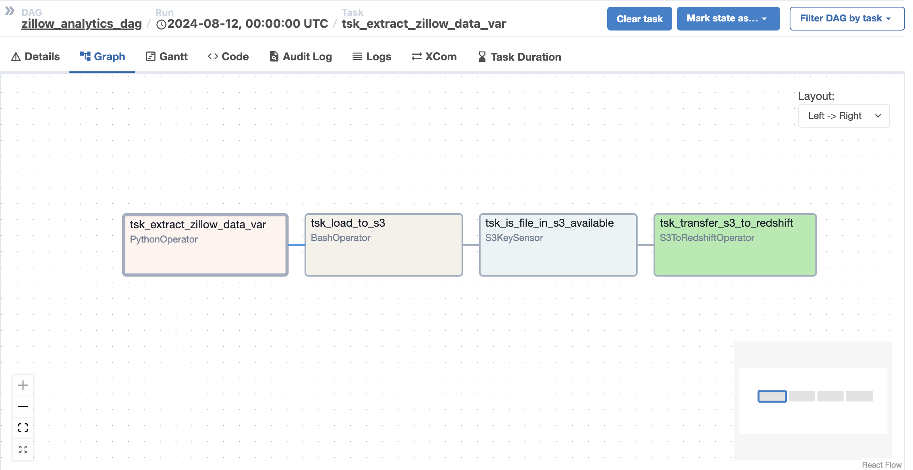
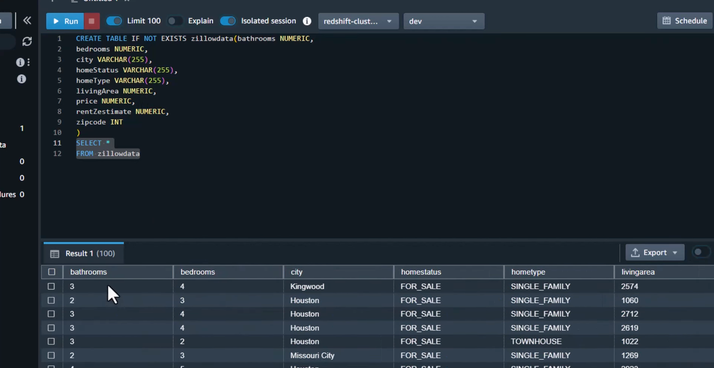
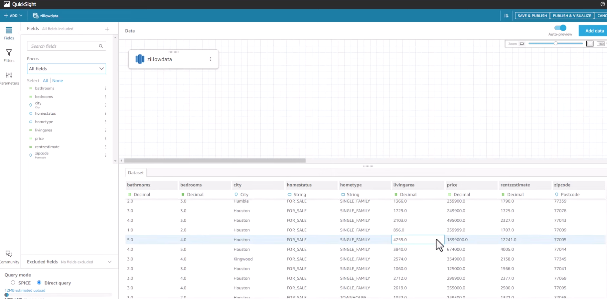
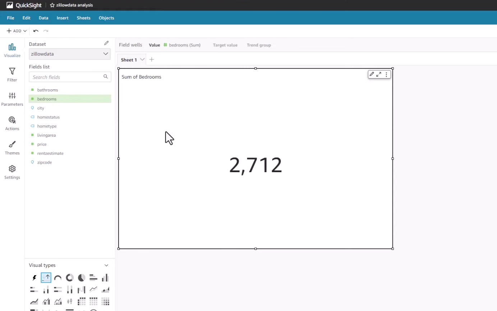
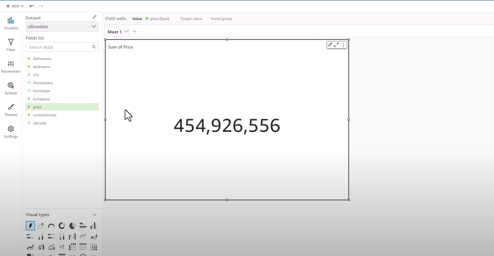
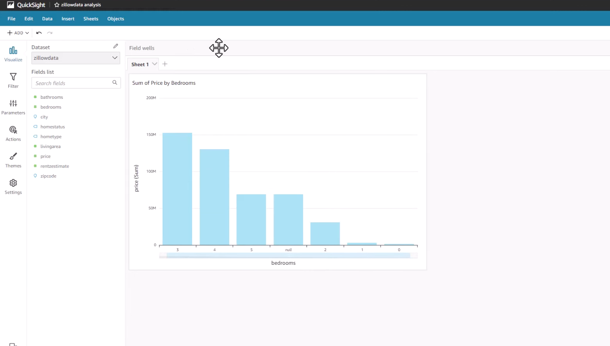
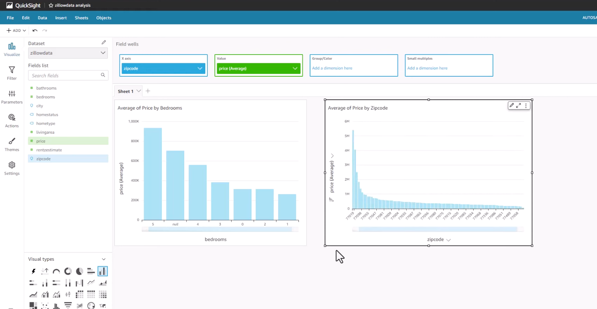

# Zillow Data Analytics - End-To-End Python ETL Pipeline

This is Zillow Data Analytics project - a project demonstrating an end-to-end ETL Pipeline using Python, Apache Airflow, RapidAPI for Zillow housing data and Amazon Web Services like S3, EC2, Lambda Functions, Redshift, and Quicksight.

```
Please don't forget to ⭐ this repo if you found it helful. Means a lot!
```

## Architecture

Design: https://tinyurl.com/4k852jrj (login required)




## DAG - Flow of process



## Tech Stack

- Python
- Apache Airflow
- RapidAPI for Zillow housing data
- Amazon Web Services
    - AWS EC2
    - AWS Lambda Functions
    - AWS S3 Bucket
    - AWS Redshift
    - AWS Quicksight

## Setup & Deployment

1. Clone this repo to your local machine.

2. Zillow API I used from RapidAPI - https://rapidapi.com/s.mahmoud97/api/zillow56 

3. Create an EC2 instance on which out Apache Airflow server will run. **From my experience from building the project, I would highly recommend to use t2.medium or above as instance type as you might experience freezing or lagging of console while running the Airflow server.**

4. Connect to EC2 instance and open the instance CLI. Run bwlow commands:

```
sudo apt update
sudo apt install python3-pip
sudo apt install python3.10-venv
python3 -m venv venv
source venv/bin/activate
pip install --upgrade awscli
sudo pip install apache-airflow
airflow standalone
pip install apache-airflow-providers-amazon
```

When you run the ```airflow standalone``` command, you would get a message saying 'Airflow is ready' followed by username and password to be used to access the server.

5. To access the Apache airflow server, use the EC2 instance public IPv4 address along with port 8080. For eg: 54.212.131.242:8080. Now, enter the username and password from step 4.

6. SSH connect your VS code to EC2 instance. You should be able to see an `airflow` folder. Inside this folder, create a `dag` folder - this is the folder that is read by airflow to create the process workflow dag.

7. Inside the `dag` folder, copy `zillowanalytics.py` file.

8. Inside the `airflow` folder, create a file `config-api.json`. Create below variables and define them:
```
x-rapidapi-key
x-rapidapi-host
```
You can get these values once you create a user on RapidAPI - step 2.

9. Create 2 lambda functions and 3 S3 buckets as shown in the design diagram. Code for lambda is given in the repo. Remember to give necessary permissions to lambda and S3.

10. Now, create a Redshift cluster. Create your username and password for database. After sometime, a cluster will be created. Now go to Query Editor V2 on the side navbar. Inside your cluster, create a database - use same username and password you set while creating cluster.

11. Use below query to create table:

```
CREATE TABLE IF NOT EXISTS zillowdata(
bathrooms NUMERIC,
bedrooms NUMERIC,
city VARCHAR(255)
homeStatus VARCHAR(255),
homeType VARCHAR(255),
livingArea NUMERIC,
price NUMERIC,
rentZestimate NUMERIC,
zipcode INT
)
```

12. Complete the Quicksight setup by signing up AWS account for Quicksight. Once done, you will get account name and username.

13. Go to datasets tab on the side pane and create a dataset. Select Redshift as the data source and configure Redshfit. Once done, you should be able to see your table in datasets.

14. Select your table and click on 'Use In Analysis' on top-right corner. Feel free to explore and analyze data.


## Screenshots











